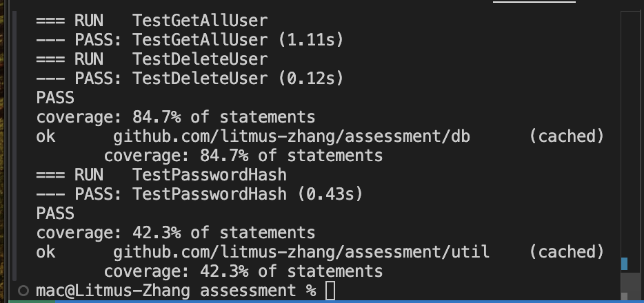

# Invoice Management System

This is a task to  build the API for selected pages of an invoice management system.

## Tech Stack Used
- Go-Gin (Golang API Framework)
- Postgres (Data store)
- Golang-Migrate (for Database migration)
- Sqlc (For ORM)
- Make (for Project Build)

## API Documentation
- Postman: [API DOC](https://documenter.getpostman.com/view/11885037/2sAY52bJay)

## Entity Relationship Diagram
- Link to ERD: [ERP Link](https://dbdiagram.io/d/Invoice-Management-System-65a0439fac844320aebe15c7)

## Test Report
- Code Coverage:

